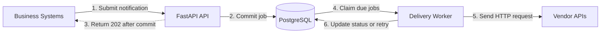

# Reliable HTTP Notification Service

> A minimal internal service for accepting outbound HTTP(S) notification jobs and delivering them asynchronously with durable storage, automatic retries, and visible terminal failures.

[](https://www.python.org/)
[](https://fastapi.tiangolo.com/)
[](https://www.postgresql.org/)
[](#delivery-semantics)
[](#scope)

---

## Table of Contents

- [Overview](#overview)
- [Implementation Status](#implementation-status)
- [Architecture](#architecture)
- [Core Capabilities](#core-capabilities)
- [API](#api)
- [Job Lifecycle](#job-lifecycle)
- [Reliability and Failure Handling](#reliability-and-failure-handling)
- [Data Model](#data-model)
- [Repository Structure](#repository-structure)
- [Implementation Plan](#implementation-plan)
- [Function Documentation](#function-documentation)
- [Getting Started](#getting-started)
- [Quick Smoke Test](#quick-smoke-test)
- [Engineering Decisions and Tradeoffs](#engineering-decisions-and-tradeoffs)
- [Scope](#scope)
- [Future Evolution](#future-evolution)
- [AI Use Disclosure](#ai-use-disclosure)

---

## Overview

Internal business systems often need to notify external vendors after important events. Examples include notifying an advertising platform after a successful registration, updating a CRM after a subscription payment, or informing an inventory system after a purchase.

Calling each vendor directly creates repeated delivery logic in every business system. Each caller would need to handle timeouts, retries, vendor outages, and request tracking.

This project moves that responsibility into one small internal service. A business system submits the target URL, HTTP method, headers, and JSON body. The service stores the job in PostgreSQL and immediately returns a job ID. A background worker then delivers the request and retries temporary failures.

**The caller does not wait for the vendor response. A job is acknowledged only after it has been durably stored.**

---

## Implementation Status

**The MVP and final delivery audit are complete.** The full delivery lifecycle is implemented and packaged as a reproducible Docker Compose environment with PostgreSQL, automatic migrations, the API, the Worker, and an offline mock vendor.

The implementation order and completed exit criteria are recorded in [`Plan.md`](Plan.md).

---

## Architecture

The following diagram shows the implemented MVP architecture. The API and Worker run as separate processes against the same PostgreSQL database.



The API and worker are separate processes built from the same codebase. PostgreSQL is both the durable system of record and the lightweight job queue.

This keeps the MVP easy to run and understand: there is no Redis, RabbitMQ, Kafka, or Celery dependency.

---

## Core Capabilities

- **Implemented — asynchronous submission**: returns `202 Accepted` only after a job is stored.
- **Implemented — flexible requests**: accepts an HTTP(S) URL, `POST`, `PUT`, `PATCH`, or `DELETE`, up to 50 headers, and an optional JSON object body.
- **Implemented — durable jobs**: stores delivery state in PostgreSQL so queued work survives process restarts.
- **Implemented — status lookup**: allows callers to inspect a job using its UUID.
- **Implemented — duplicate-safe submission**: supports an optional `Idempotency-Key`; concurrent duplicate submissions create one row.
- **Implemented — single-attempt delivery**: forwards the stored request with a 10-second timeout and a stable `X-Notification-Id`.
- **Implemented — result classification**: treats `2xx` as success; network errors, `408`, `429`, and `5xx` as retryable; and other responses as permanent failures.
- **Automatic processing**: a polling Worker safely claims due rows with `FOR UPDATE SKIP LOCKED`.
- **Retry lifecycle**: schedules retryable failures after approximately 1, 2, 4, and 8 minutes, with at most five started attempts.
- **Crash recovery**: expired `processing` leases return to `retrying`, or become `dead` after the final attempt.
- **Graceful shutdown**: SIGINT and SIGTERM stop the Worker before it claims another batch.
- **Offline demo**: Docker Compose starts the complete service and deterministic success, retryable, and permanent-failure vendor endpoints.

---

## API

### Health Check — Implemented

```http
GET /health
```

The endpoint verifies that the API can execute a simple PostgreSQL query.

```json
{
  "status": "ok",
  "database": "ok"
}
```

It returns `503 Service Unavailable` when the database cannot be reached.

### Create a Notification — Implemented

```http
POST /notifications
Content-Type: application/json
Idempotency-Key: payment-123-crm
```

```json
{
  "target_url": "https://crm.example.com/contacts/123",
  "method": "POST",
  "headers": {
    "Authorization": "Bearer example-token"
  },
  "body": {
    "status": "paid"
  }
}
```

Successful response:

```http
HTTP/1.1 202 Accepted
```

```json
{
  "id": "f183bf31-53d5-42db-aeb7-42a7bfa48dc2",
  "status": "pending"
}
```

`Idempotency-Key` is optional. If the same key and payload are submitted again, the API returns the original job instead of creating another one. Reusing a key with a different payload returns `409 Conflict`.

The accepted methods are `POST`, `PUT`, `PATCH`, and `DELETE`. Invalid URLs, methods, Header syntax, or non-object JSON bodies return `422 Unprocessable Content`. An idempotent replay includes `Idempotent-Replayed: true` in the response headers.

### Get Notification Status — Implemented

```http
GET /notifications/f183bf31-53d5-42db-aeb7-42a7bfa48dc2
```

Example response:

```json
{
  "id": "f183bf31-53d5-42db-aeb7-42a7bfa48dc2",
  "status": "pending",
  "attempt_count": 0,
  "next_attempt_at": "2026-08-12T20:20:00Z",
  "last_status_code": null,
  "last_error": null,
  "created_at": "2026-08-12T20:20:00Z",
  "updated_at": "2026-08-12T20:20:00Z"
}
```

The API does not store or return external response bodies. They may contain sensitive or unexpectedly large data and are not needed for delivery decisions.

---

## Job Lifecycle

```text
pending ──▶ processing ──▶ succeeded
                │
                ├── temporary failure ──▶ retrying ──▶ processing
                │
                └── permanent failure or attempts exhausted ──▶ dead
```

| Status | Meaning |
|---|---|
| `pending` | Stored and waiting for its first delivery attempt |
| `processing` | Claimed by a worker |
| `retrying` | A temporary failure occurred and another attempt is scheduled |
| `succeeded` | The external API returned a `2xx` response |
| `dead` | The request cannot be retried or has exhausted all attempts |

A recovery check returns jobs that remain in `processing` beyond the 60-second worker lease to `retrying`. A late result from the expired worker is ignored, preventing it from overwriting the recovered task.

---

## Reliability and Failure Handling

### Delivery Semantics

The service provides **at-least-once delivery**, not exactly-once delivery.

Once the API returns `202 Accepted`, the job is stored in PostgreSQL and will remain available after an API or worker restart. However, duplicate delivery is still possible. For example, a vendor may process a request successfully while its response is lost on the network. The worker cannot know that the request succeeded, so it must retry.

Every outbound request includes a stable identifier:

```http
X-Notification-Id: f183bf31-53d5-42db-aeb7-42a7bfa48dc2
```

Vendors that support idempotency can use this value to reject duplicate processing.

### Retry Policy

| Result | Action |
|---|---|
| HTTP `2xx` | Mark `succeeded` |
| Network error or timeout | Retry |
| HTTP `408`, `429`, or `5xx` | Retry |
| Redirects and non-retryable HTTP responses | Mark `dead` because the request is unlikely to succeed unchanged |
| Maximum attempts reached | Mark `dead` and retain the last error |

The MVP makes at most five delivery attempts. Retries use capped exponential delays of approximately 1, 2, 4, and 8 minutes. Each outbound request has a 10-second timeout.

The worker stores only a bounded error message and the latest HTTP status code. Application logs contain job IDs and exception types, never request headers or bodies. SQL statement echo is deliberately disabled because SQL parameters may contain stored credentials.

### Long Vendor Outages

The service does not retry forever. Indefinite retries would hide broken integrations and allow the queue to grow without limit. A job becomes `dead` after its final attempt and remains queryable for investigation. Manual replay and alerting are reasonable follow-up features, but they are outside the first version.

---

## Data Model

The MVP uses one main PostgreSQL table:

| Field | Purpose |
|---|---|
| `id` | Stable UUID for tracking and downstream idempotency |
| `idempotency_key` | Optional unique key for duplicate-safe submission |
| `target_url` | Destination HTTP(S) URL |
| `method` | Allow-listed HTTP method |
| `headers` | Request headers stored as `JSONB` |
| `body` | JSON request body stored as `JSONB` |
| `status` | Current lifecycle state |
| `attempt_count` | Number of started delivery attempts, including attempts interrupted by a worker crash |
| `next_attempt_at` | Earliest time at which the worker may retry |
| `locked_at` | Start time of the current worker lease |
| `last_status_code` | Most recent external HTTP status, when available |
| `last_error` | Bounded description of the most recent failure |
| `created_at`, `updated_at` | Audit timestamps |

Workers claim due rows with `SELECT ... FOR UPDATE SKIP LOCKED`, mark them as `processing`, and commit before making any network request. This keeps database transactions short while preventing two workers from claiming the same job. It is enough for the MVP and also permits multiple workers later without adding a separate message broker.

---

## Repository Structure

```text
.
├── app/
│   ├── __init__.py
│   ├── main.py              # FastAPI application entry point
│   ├── mock_vendor.py       # Local-only vendor used by the offline smoke test
│   ├── api.py               # Health and notification endpoints
│   ├── config.py            # Environment-based configuration
│   ├── database.py          # PostgreSQL session setup
│   ├── delivery.py          # One-attempt HTTP delivery and result classification
│   ├── models.py            # SQLAlchemy job model
│   ├── repository.py        # Notification persistence and idempotency
│   ├── schemas.py           # Validated API request and response models
│   ├── worker.py            # Polling loop and graceful process entry point
│   └── worker_repository.py # Claim, retry, completion, and recovery transitions
├── migrations/
│   └── versions/            # Alembic database revisions
├── tests/                   # Unit tests for the API, delivery, worker, and mock vendor
├── .env.example             # Local configuration template
├── .dockerignore            # Small and secret-free Docker build context
├── alembic.ini              # Migration configuration
├── docker-compose.yml       # Complete local service orchestration
├── Dockerfile               # Locked Python 3.11 application image
├── pyproject.toml
├── AI_USAGE.md              # Detailed disclosure of AI assistance and human review
├── Plan.md                  # Ordered implementation batches and exit criteria
├── FUNCTIONS.md             # Plain-Chinese explanation of every function
└── README.md
```

---

## Implementation Plan

[`Plan.md`](Plan.md) divides the implementation into small, ordered batches. Each batch defines its scope, tests, completion criteria, documentation updates, and suggested commit before work moves to the next batch.

---

## Function Documentation

[`FUNCTIONS.md`](FUNCTIONS.md) explains every implemented function in plain Chinese, including its purpose, inputs, return value, main steps, failure behavior, and side effects. It is updated together with the code whenever a function is added, changed, or removed.

---

## Getting Started

### Prerequisites

- Docker with Docker Compose, or
- Python 3.11+, [uv](https://docs.astral.sh/uv/), and PostgreSQL 15+

### Run with Docker Compose

Clone the repository and create the local environment file:

```bash
git clone <your-repo-url>
cd rc_<your_nickname>
cp .env.example .env
```

Build and start PostgreSQL, migrations, the API, the Worker, and the mock vendor:

```bash
docker compose up --build -d
```

The `migrate` service exits with code `0` after applying the latest Alembic revision. The other services then start in dependency order.

View service logs when needed:

```bash
docker compose logs -f api worker
```

Default local endpoints:

- API: `http://localhost:8000`
- Interactive API documentation: `http://localhost:8000/docs`
- Health check: `http://localhost:8000/health`
- Mock vendor inspection: `http://localhost:9000/docs`

Stop the services while preserving PostgreSQL data:

```bash
docker compose down
```

### Run Directly with uv

The project pins Python 3.11 in `.python-version` and uses `uv.lock` for reproducible dependencies.

Create or refresh the local virtual environment:

```bash
uv sync --dev
```

Activate it when you want to run commands directly:

```bash
source .venv/bin/activate
```

The `.venv` directory is local-only and is excluded from Git. With PostgreSQL available, run migrations and start the two application processes:

Start PostgreSQL:

```bash
docker compose up -d db
```

Apply the database migration:

```bash
uv run alembic upgrade head
```

Start the API:

```bash
uv run uvicorn app.main:app --reload
```

In another terminal, start the Worker:

```bash
uv run python -m app.worker
```

### Run Tests

```bash
uv run ruff check .
uv run pytest
```

---

## Quick Smoke Test

With PostgreSQL and the API running, first check service health:

```bash
curl -i http://localhost:8000/health
```

Expected body:

```json
{
  "status": "ok",
  "database": "ok"
}
```

Create a notification addressed to the mock vendor inside the Compose network:

```bash
curl -i -X POST http://localhost:8000/notifications \
  -H 'Content-Type: application/json' \
  -H 'Idempotency-Key: smoke-test-1' \
  -d '{
    "target_url": "http://mock-vendor:9000/success",
    "method": "POST",
    "headers": {},
    "body": {"event": "payment.succeeded"}
  }'
```

Copy the returned `id` and query the stored state:

```bash
curl http://localhost:8000/notifications/<notification-id>
```

With the Worker running, the status moves from `pending` through `processing` to `succeeded`. Confirm that the mock vendor received the same notification ID and Body:

```bash
curl http://localhost:9000/received/<notification-id>
```

To exercise failure handling, submit another request with one of these target URLs. Use a new `Idempotency-Key` for each target; reusing `smoke-test-1` with a changed URL correctly returns `409 Conflict`.

| Target URL | Expected status |
|---|---|
| `http://mock-vendor:9000/retryable` | `retrying` after HTTP `503` |
| `http://mock-vendor:9000/permanent` | `dead` after HTTP `400` |

---

## Engineering Decisions and Tradeoffs

### Why FastAPI?

FastAPI provides request validation, clear type definitions, asynchronous HTTP support, and generated OpenAPI documentation with little framework code. It keeps the API layer small and easy to review.

An alternative would be Flask. Flask is also suitable, but this project benefits from FastAPI's built-in validation and API schema generation.

### Why PostgreSQL as the Queue?

The system already needs durable storage for job state. Using PostgreSQL for both storage and job claiming removes an additional service from the MVP. Transactions and row-level locks provide the reliability and concurrency control required at the expected first-version scale.

An alternative would be Redis with Celery, RabbitMQ, or a managed queue. Those options provide higher throughput and richer queue features, but add deployment, monitoring, and failure modes that are not justified by the current requirements.

### Why a Separate Worker?

Delivery must not run inside the request handler. An external API may be slow or unavailable, and coupling delivery to the incoming request would increase latency and make failures visible to the business system. A separate worker keeps submission fast and allows delivery to continue independently.

### Why Not Exactly Once?

Exactly-once side effects cannot be guaranteed across an ordinary HTTP boundary. If the vendor processes a request but the response is lost, this service cannot safely determine whether it should retry. At-least-once delivery plus a stable notification ID is the simpler and more honest contract.

---

## Scope

### Included in the MVP

- trusted internal callers
- JSON request bodies
- configurable HTTP(S) destinations and headers
- durable asynchronous delivery
- at-least-once semantics
- retry scheduling and terminal failure records
- duplicate-safe job submission
- status lookup
- database-aware health checks

### Intentionally Excluded

- a web-based operations dashboard
- vendor-specific adapters or workflow orchestration
- Kafka, Redis, RabbitMQ, or Celery
- multi-region deployment and disaster recovery
- exactly-once delivery guarantees
- automatic infinite retries
- payload transformation templates
- per-vendor rate limiting
- manual replay and alerting interfaces

Authentication and authorization are also outside the demo implementation because callers are assumed to be inside a trusted network. A production deployment must add service authentication and access control.

The MVP trusts internal callers and accepts HTTP(S) destinations. A production version should require HTTPS for external traffic, maintain an approved destination list, and block loopback, link-local, and private network targets to reduce server-side request forgery risk.

Request headers are stored in PostgreSQL because they are needed for later delivery. In production, credentials should preferably be referenced from a secret manager or encrypted at rest rather than stored directly in the job row.

---

## Future Evolution

The current design should evolve only when observed load or operational needs justify it:

1. Add metrics and alerts for queue depth, delivery latency, retry volume, and dead jobs.
2. Add an authenticated operations API for inspecting and replaying dead jobs.
3. Add per-vendor concurrency limits and circuit breakers for repeated outages.
4. Partition or archive old job rows as the table grows.
5. Scale worker replicas while continuing to use PostgreSQL row locking.
6. Move job dispatch to a managed queue only when database polling becomes a measured bottleneck.

This path preserves the simple API contract while allowing the delivery implementation to change behind it.

---

## AI Use Disclosure

AI assisted with requirement analysis, implementation, testing, container setup, and documentation. Its output was reviewed and corrected rather than accepted automatically, and AI is not part of the runtime system.

See [`AI_USAGE.md`](AI_USAGE.md) for the complete disclosure, including suggestions that were not adopted, AI output that required correction, decisions made by the author, and final verification evidence.
